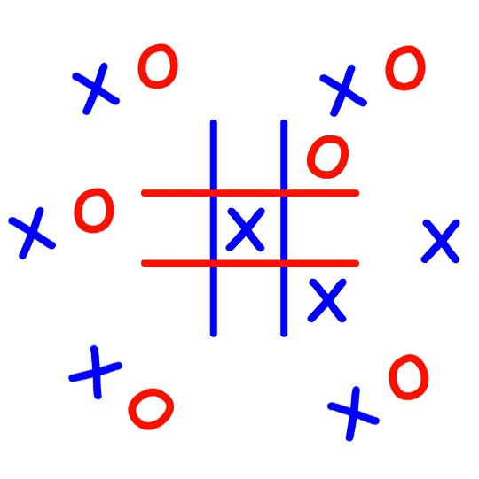
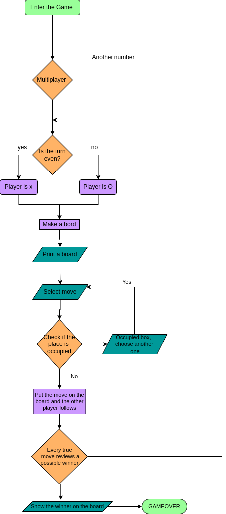

<h1 align="center">

 <h2 style="color:"> TIC TAC TOE 

 
</h1>

<h1 align=center>
UNIT 3
</h1>

 
<h2 align="center">
</h2>

<h2 align="left">

 <b style="color:#1C1B17"> INDEX 
 
</h2></b> 

<h3 style="font-family:Arial;",><b>

[ 1- How to run](https://github.com/UP210246/UP210246_CPP/tree/main/U3#-how-to-run--) 

[2- Things to consider](https://github.com/UP210246/UP210246_CPP/tree/main/U3#-things-to-consider--)  

[3- Flowchart](https://github.com/UP210246/UP210246_CPP/tree/main/U3#--flowchart--)  

[4- Code execution & explanation](https://github.com/UP210246/UP210246_CPP/tree/main/U3#--code-execution--explanation--)  

[5- Closure](https://github.com/UP210246/UP210246_CPP/tree/main/U3#--closure--)  

</h3></b>    
    
<h2 align="center">

<b style="color:#1C1B17"><i> HOW TO RUN 
 
</h2></b> </i>

This cat game only has a multiplayer game mode, player 1 is x which is blue and for player 2 it is O and it is red, you can only choose the numbers from 1 to 9 and the placement is shown on the board, the player with 3 in a line wins

 In this folder you will find the game "Gato" [(01_Gato.cpp)](https://github.com/UP210246/UP210246_CPP/blob/main/U3/01_Gato.cpp)         written in the C++ programming language.

<h3> 

[Return to index](https://github.com/UP210246/UP210246_CPP/tree/main/U3#--index--)

</h3>  

<h2 align="center">

<b style="color:#1C1B17"><i> THINGS TO CONSIDER 
 
</h2></b> </i>

<h3 align="center">

 Possible Errors.
 
</h3></b></b>

 
<pre>
First we know that this game is not entirely perfect
we have to consider that we cannot put LETTERS or DECIMAL NUMBERS otherwise we would have to restart the program.

 When the game does not ask or return anything from a winner, to play again you have to restart the program.
</pre>
 
</b>
</b>

<h3> 

[Return to index](https://github.com/UP210246/UP210246_CPP/tree/main/U3#--index--)

</h3>  

<h2 align="center">

 <b style="color:"><i> FLOWCHART 
 
</h2></b></i>

 

     
<h2 align="center">

 <b style="color:"><i> CODE EXECUTION & EXPLANATION 
 
</h2></b></i>

 
 

The game starts showing the board
The color blue player 1
The red player player 2
  

  

First move of player 1

 
  

Second move of player 2

 
  

If any of the 2 players wants to replace an occupied square, it will send them the following message "occupied box, choose another one"

 
  

Player 1 win

 
  

Player 2 win

 
  

<h2 align="center">

 <b style="color:"><i> CLOSURE 
 
</h2></b></i> 

In conclusion, the work was a bit complicated for me to compile all the functions, I had never worked with the functions but I was amazed at all the work you can do with them and everything you can create.

The tips that the teacher gave us were also very useful, such as the colors or the arrangement of the cat, I lacked the implementation of artificial intelligence because of the times, as I said before, the compilation of this was complicated.

I hope at work connect four to be able to do better with the help of my team
</b>  

<h3> 

[Return to index](https://github.com/UP210246/UP210246_CPP/tree/main/U3#--index--)

</h3> 

